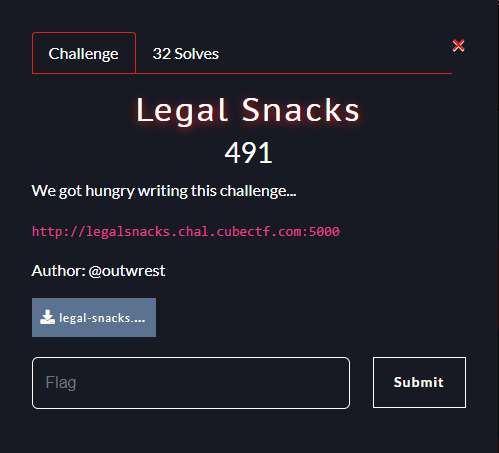
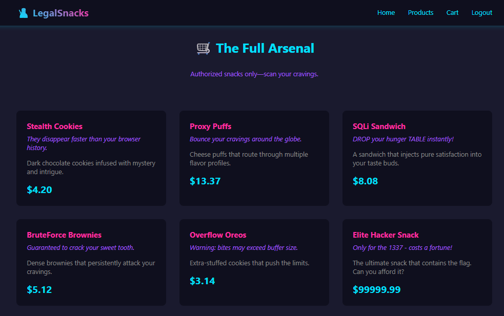
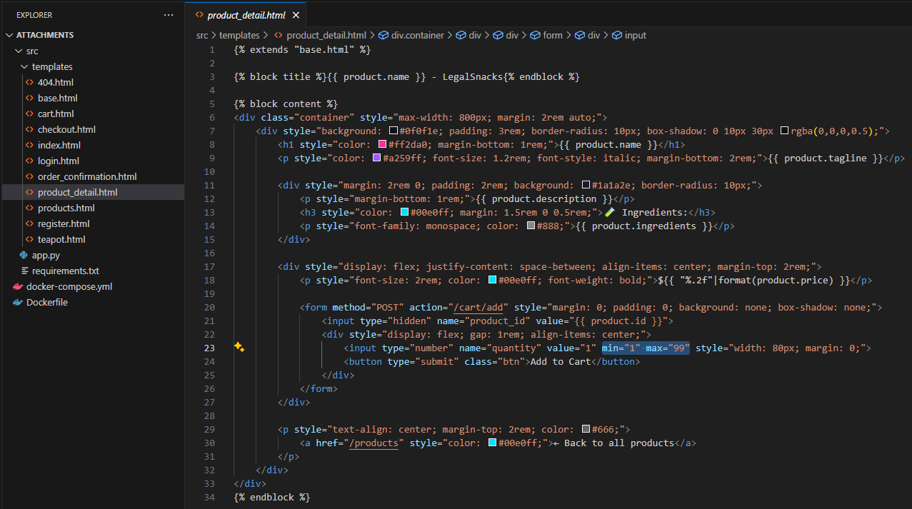
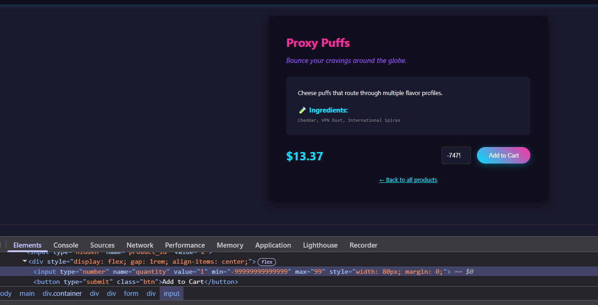
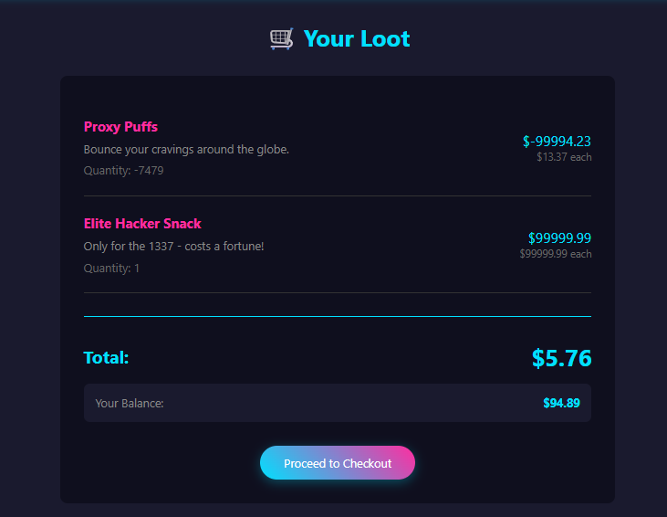
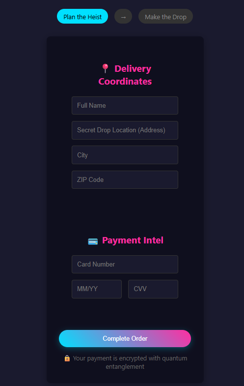
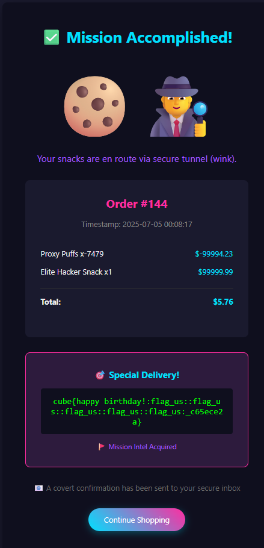

# Reto 1 - Legal Snacks
Se presenta el reto

Nos dan una URL y un zip que contiene la aplicacion que corre el sitio, que utiliza python y flask.
En la seccion de productos hay un producto que contiene la flag pero cuesta $99999.99 y se tiene $100 de balance, lo añadimos al carro pero no se puede proceder con la compra.

Inspeccionando los templates html y la aplicacion provista notamos que hay comprobaciones que se hacen en los templates y no en la aplicacion, es decir se hacen del lado del cliente. Puntualmente no se verifica la cantidad en `add_to_cart()` y no se verifica la existencia de números negativos en `cart()`.

.png)

.png)

Aprovechando esto añadimos -7479 unidades (unidades negativas) de un producto que vale $13,37, para que al sumarlo con el producto que contiene la flag el total del carrito sea un numero pequeño, dentro de nuestro balance. Esto se realiza simplemente modificando el html para que acepte un valor minimo (también se podria realizar enviando la petición HTTP directamente con herramientas como curl o postman).

Como resultado se tiene un carrito con un precio final de solo $5,76 con el que se puede proceder a la compra.

Para finalizar la compra se piden datos de entrega y una tarjeta de crédito.

Sospechando que sucederá lo mismo que con las validaciones simplemente quitamos `required` de todos los campos (asi como modificamos `min` anteriormente) pudiendo asi completar la compra y obteniendo la flag

