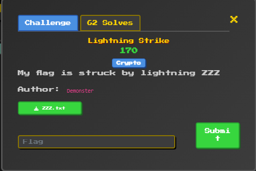
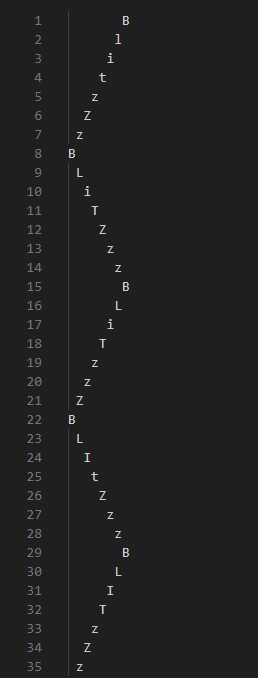
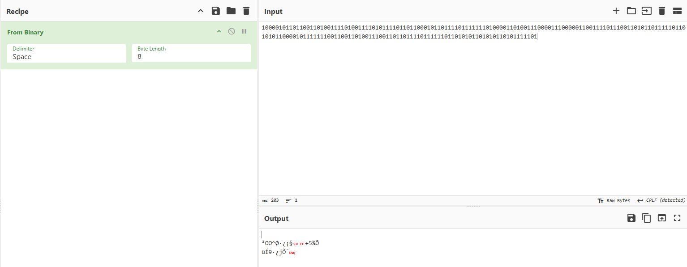
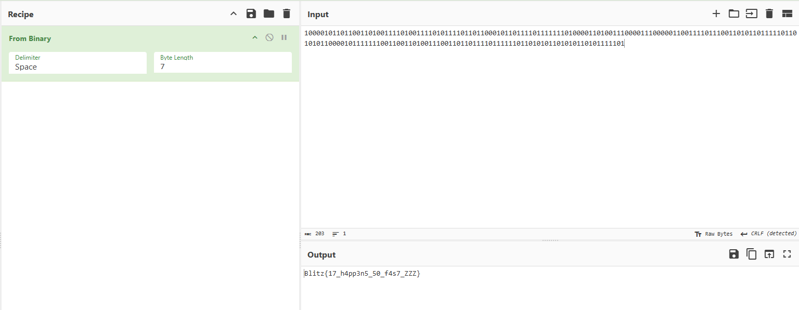

# Reto 2 - Lightning Strike

Se presenta el reto

Nos dan un txt que aparentemenete contiene la flag. El txt contiene el string `blitzzz` escrito de arriba hacia abajo muchas veces.

Lo primero que notamos es que cambia que caracteres tienen mayusculas y minusculas en cada repeticion (`BlitzZz`, `BLiTZzz`). Ahi sospechamos una codificación binaria, probamos primero con mayusculas = 1, minusculas = 0 y creamos solve.py, el cual recibe como parámetro este archivo, extrae los caracteres y los transforma a binario según sean mayúsculas o no. (Para ejemplificar, `BlitzZz` -> `1011011`, `BLiTZzz` -> `11010110`)
Este es el string resultante:

`10000101101100110100111101001111010111101101100010110111101111111010000110100111000011100000110011110111001101011011111011010101100001011111110011001101001110011011011110111111011010101101010110101111101`

Al convertirlo de binario con cyberchef no nos da un string legible.

Pero considerando que en el txt original la cadena 'blitzzz' es de 7 caracteres y que ASCII tiene 2^7 caracteres imprimibles lo tratamos con bytes de esa longitud y obtenemos la flag.

