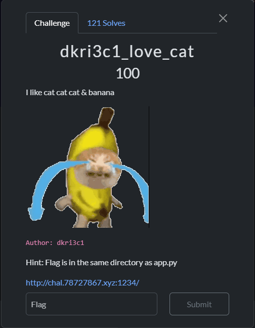
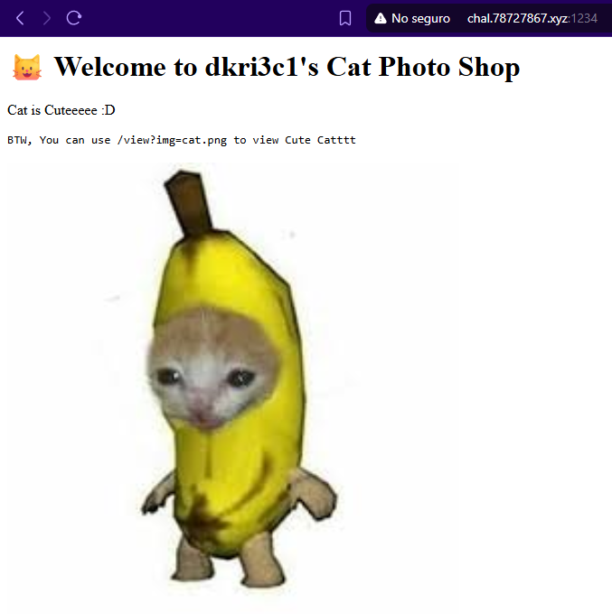
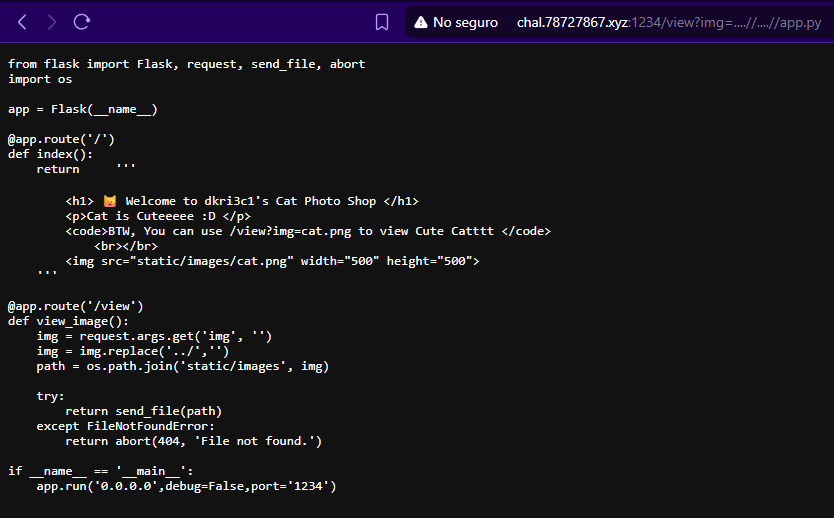
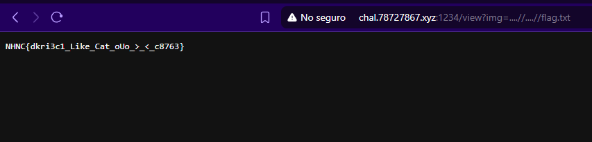

Se presenta el reto

Nos dan un sitio y de entrada una pista de que la flag está en el mismo directorio que app.py.
Al acceder al sitio hay muy poca información y se indica que con /view?img=cat.png se puede ver la imagen.

Con lo que se tiene lo único que se nos ocurre es path traversal, encontrar primero la ubicación de app.py y luego la flag que sabemos que está en el mismo directorio.

Se prueba acceder a `app.py`, `./app.py`, `../app.py`, `../../app.py` sin efecto. Suponiendo algun tipo de filtro buscamos formas de escaparlo con `..%2f` `%2e%2e%2f` y al probar puntualmente con `....//....//app.py` se consigue acceso al archivo.

Leyendo el código fuente, se ve que el único filtro que tenía la funcion view_image() era quitar la cadena `../`. Nuestro bypass funciona porque al quitar esa cadena de nuestro payload se vuelve a formar la misma cadena

( `....//` == `..` + `../` + `/` ) y luego del filtrado

( `..` + `/` == `../` )

Si bien no hay indicios adicionales sobre la flag, sabiendo que está en el mismo directorio probamos acceder a `....//....//flag.txt` y efectivamente la flag se encuentra allí

