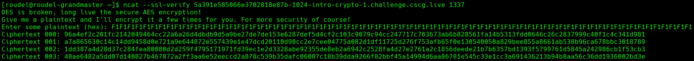
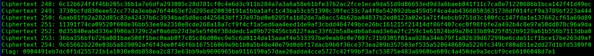
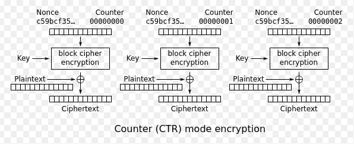
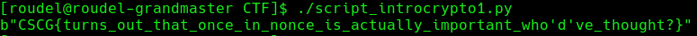
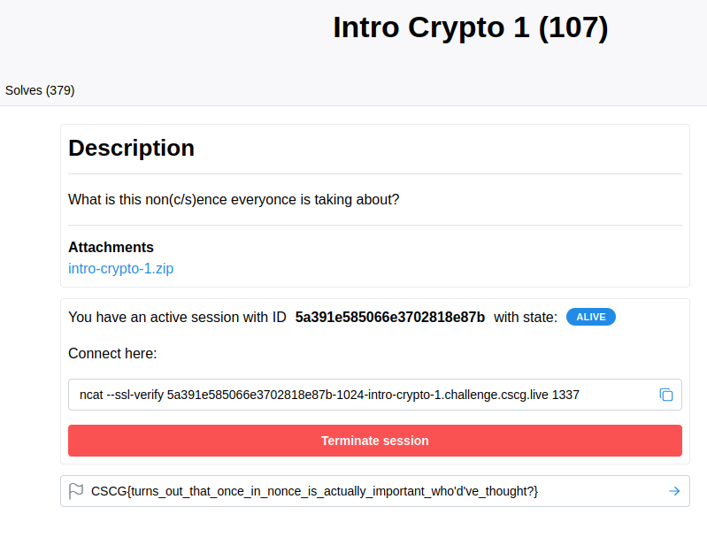

# Resumen
El desafió es la explotación de un misuso de el modo CTR en encriptado simétrico, que consiste en reutilizar múltiples veces el nonce en el proceso de encriptado.

# Write up
El ejercicio nos presenta con el siguiente codigo:

```python
#!/usr/bin/env pypy3

import os
from pydoc import plain
from sys import byteorder
from Crypto.Cipher import AES
from Crypto.Util import Counter
import hashlib

# Create a secret.py file with a variable `FLAG` for local testing :)
from secret import FLAG

secret_key = os.urandom(16)

def encrypt(plaintext, counter):
    m = hashlib.sha256()
    m.update(counter.to_bytes(8, byteorder="big"))

    alg = AES.new(secret_key, AES.MODE_CTR, nonce=m.digest()[0:8])
    ciphertext = alg.encrypt(plaintext)

    return ciphertext.hex()


def main():
    print("DES is broken, long live the secure AES encryption!")
    print("Give me a plaintext and I'll encrypt it a few times for you. For more security of course!")

    try:
        plaintext = bytes.fromhex(input("Enter some plaintext (hex): "))
    except ValueError:
        print("Please enter a hex string next time.")
        exit(0)
    
    for i in range(0, 255):
        print(f"Ciphertext {i:03d}: {encrypt(plaintext, i)}")
    
    print("Flag:", encrypt(FLAG.encode("ascii"), int.from_bytes(os.urandom(1), byteorder="big")))

if __name__ == "__main__":
    main()

```

Se puede ver en el flow del programa que se encriptan 255 de plaintext elegidos por el atacante con el nonce siempre yendo de 0 a 254, y luego se elige al azar uno de los 255 nonces para encriptar la flag. 

Primero se ejecuto el script en un servidor remoto para obtener la longitud de la flag. Una vez obtenido el tamaño, se crea un plaintext conocido de la misma cantidad de bloques.
En este caso se eligió el plaintext: "F1F1F1F1F1F1F1F1F1F1F1F1F1F1F1F1F1F1F1F1F1F1F1F1F1F1F1F1F1F1F1F1F1F1F1F1F1F1F1F1F1F1F1F1F1F1F1F1F1F1F1F1F1F1F1F1F1F1F1F1F1F1F1F1F1F1F1F1F1F1F1F1F1F1"




El plaintext es enviado al servidor remoto para recibir los ciphertexts. También se consigue la nueva encriptación de la flag con la nueva key.




Luego teniendo en cuenta la estructura del modo CTR:




Por cada ciphertext recibido (exceptuando el de la flag), se realiza un XOR con el plaintext seleccionado, los que nos da el ciphertext del nonce.
Con el ciphertext de cada uno de los nonce, se realiza un XOR con la flag encriptada, hasta encontrar el formato de la flag.
Una vez encontrada la flag esta es impresa.




Pudiendo resolver el ejercicio.


