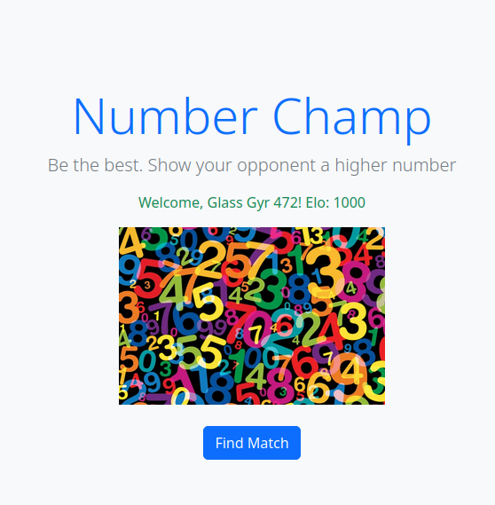
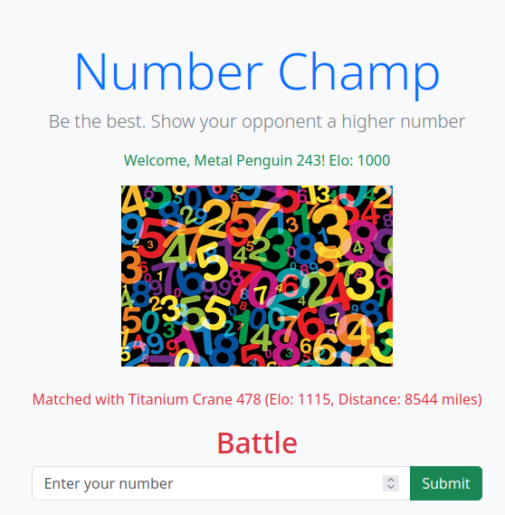
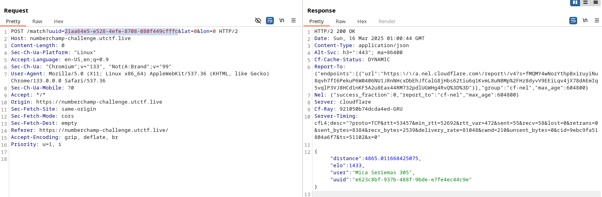
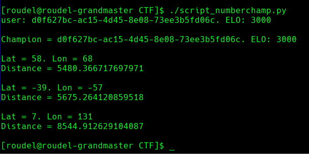
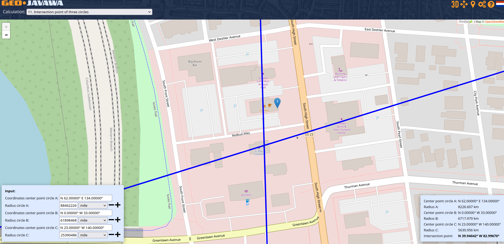
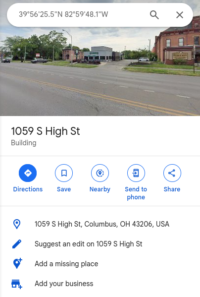
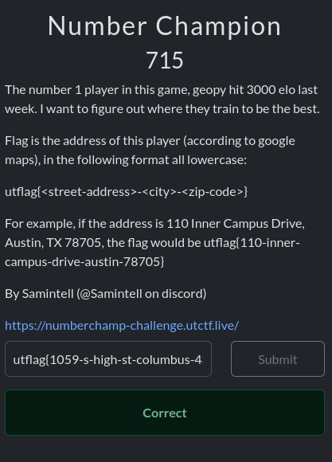

# Resumen
El desafió consiste en encontrar la dirección de unos del mejor jugador de "Number Champ". Esto se logra a través de un error de lógica que le brinda mucha libertad al usuario, que es combinado con algo de OSINT para obtener la dirección.

# Write up
El ejercicio nos presenta con la siguiente pagina:

Cuando el usuario presiona el botón de "Find Match", se encuentra una partida contra otro jugador de "Number Champ" aproximadamente de nuestro nivel (Según el ELO) y nos brinda la información de a que distancia se encuentra de nosotros.

Pero si se analiza la solicitud POST que se hace a la hora de buscar una partida, se puede ver que se enviá el UUID que identifica al usuario, y a la vez que se recibe el UUID del usuario contra el que se esta compitiendo.

Así que solo se trata de ir reemplazando nuestro UUID por el UUID de usuarios de mayor nivel hasta encontrar al mejor usuario del juego.
Una vez el usuario es encontrado, vamos a jugar varias partidas contra el cambiando nuestra dirección (LATITUD Y LONGITUD).

Con los datos de latitud y longitud, y la distancia del jugador a nosotros se puede triangular su ubicación.

Con los datos de la posición del jugador, se busca la misma en Google Maps.

Y de esta manera obtenemos nuestra flag.

