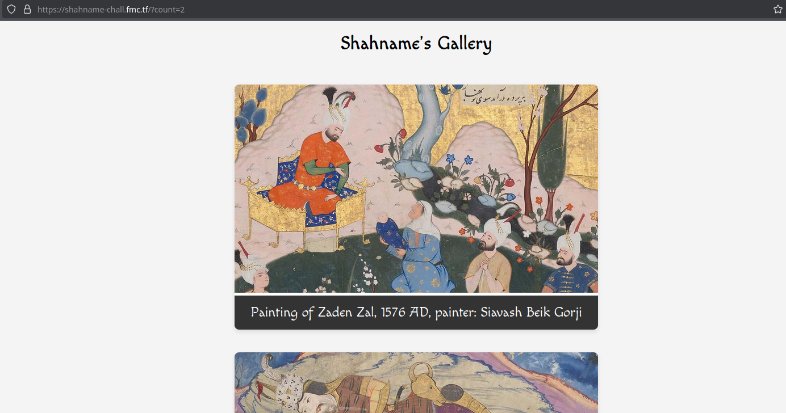
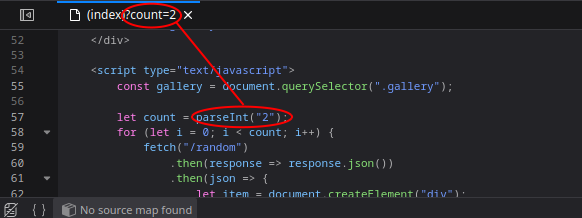
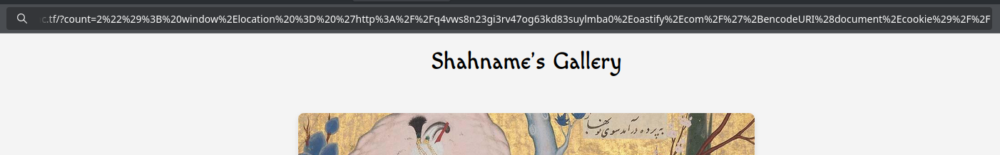
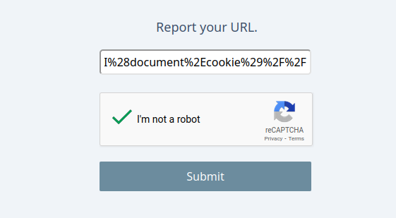
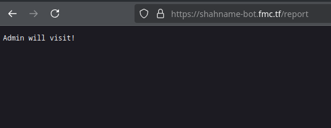
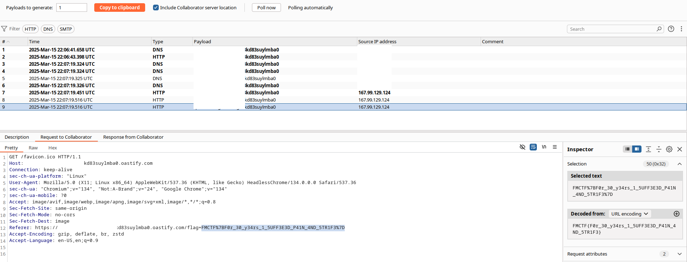

# Resumen
El desafió consiste en obtener las cookies del administrador de la pagina de una galería de fotos. Para eso se utiliza un XSS.

# Write up
El ejercicio nos presenta con la siguiente pagina:

Que al analizar el source code de los scripts de Javascript del mismo se puede encontrar una variable que no es sanitizada antes de ser utilizada.

Por lo que, si se arma un payload XSS de Javascript, se puede enviar las cookies utilizadas por el usuario a un servidor remoto.

Una vez armado el payload, este es mandado al "administrador" a través de una herramienta de "reporte".

Y de esta manera, una vez el administrador abre el link, obtenemos las cookies, y por lo tanto, la flag.

