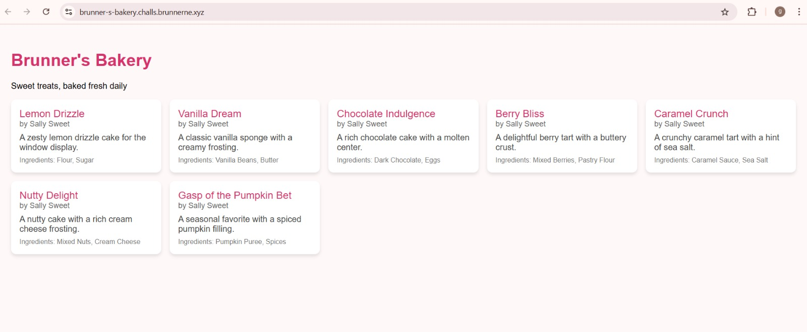
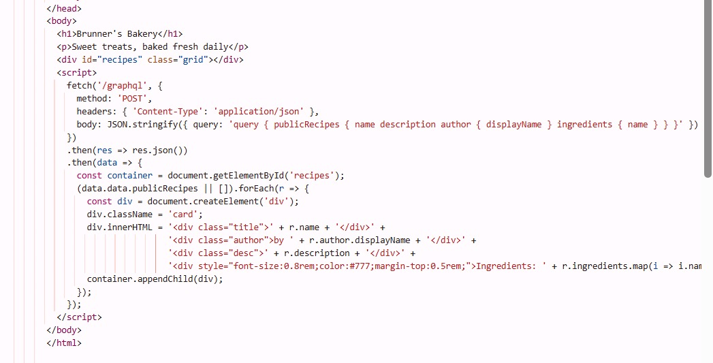
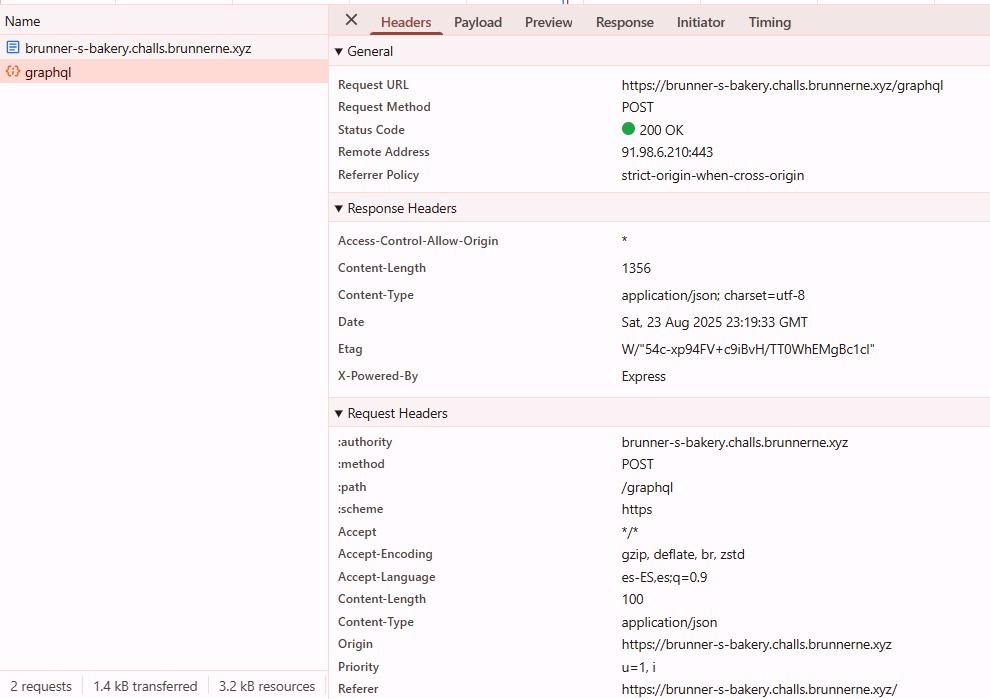
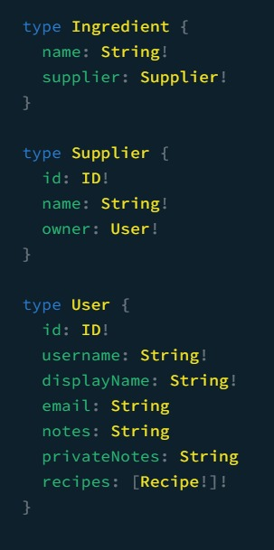
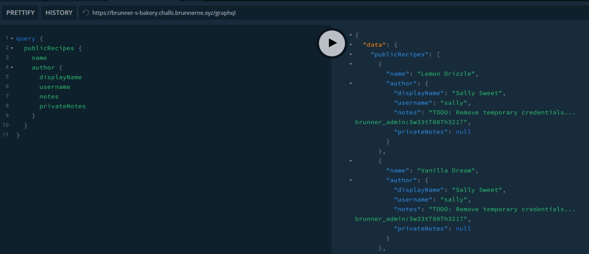
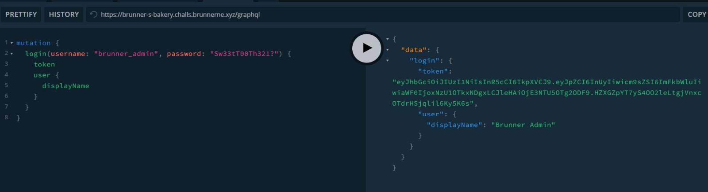
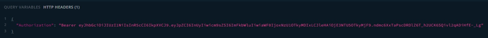

# Brunner's Bakery

# URL
https://brunner-s-bakery.challs.brunnerne.xyz/

## Writeup
Al acceder al sitio web, nos encontramos con una página de una panadería que muestra recetas.

Vemos que no hay formularios de login ni elementos interactivos evidentes, y que cada receta muestra nombre, descripción e ingredientes.

Al inspeccionar el código fuente HTML, descubrimos que las recetas se cargan dinámicamente mediante una consulta GraphQL:
  
Esto revela que existe un endpoint GraphQL en /graphql que se utiliza para obtener las recetas.

Al examinar las peticiones HTTP, confirmamos que el sitio realiza requests al endpoint /graphql:

detalles importantes: 
URL: https://brunner-s-bakery.challs.brunnerne.xyz/graphql
Método: POST
Content-Type: application/json
Status: 200 OK
CORS: Habilitado (Access-Control-Allow-Origin: *) ->permitiendo acceso desde cualquier dominio

Accedemos directamente a /graphql y encontramos GraphQL Playground habilitado, lo que nos permite explorar el esquema completo y observar que existe una query secretRecipes que probablemente sea útil.

Examinamos la estructura completa de User para entender los campos disponibles, vemos que tiene un campo llamado privateNotes accesible.

Ejecutamos una consulta ampliada a publicRecipes incluyendo campos sensibles, obteniendo como resultados el usuario y contraseña para autenticarnos 

brunner_admin:Sw33tT00Th321?

Entonces utilizamos las credenciales encontradas para autenticarnos lo que nos devuelve un JSON Web Token correspondiente al login:

Agregamos el JWT obtenido en los headers HTTP para autenticarnos:

Finalmente, ejecutamos la query a secretRecipes con todos los campos relevantes:

## FLAG
brunner{Gr4phQL_1ntR0sp3ct10n_G035_R0UnD_4Nd_r0uND}
