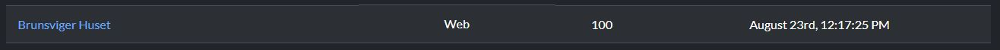
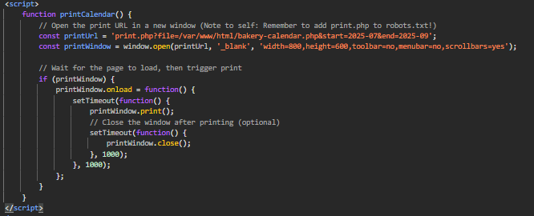
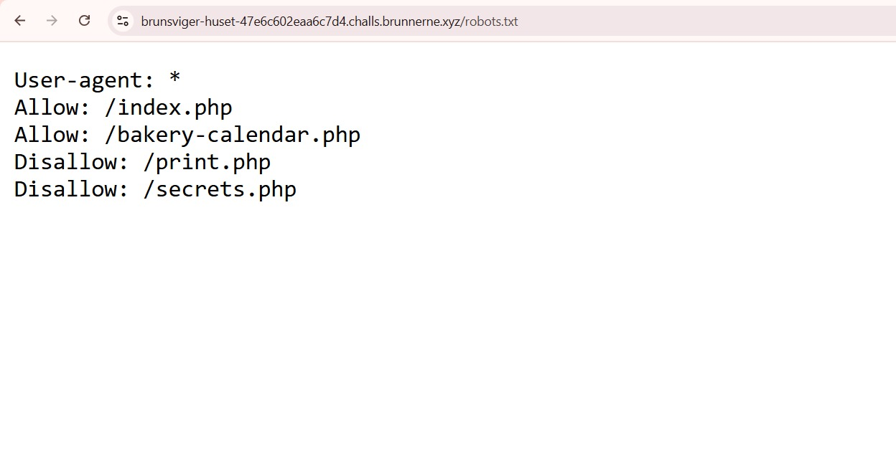
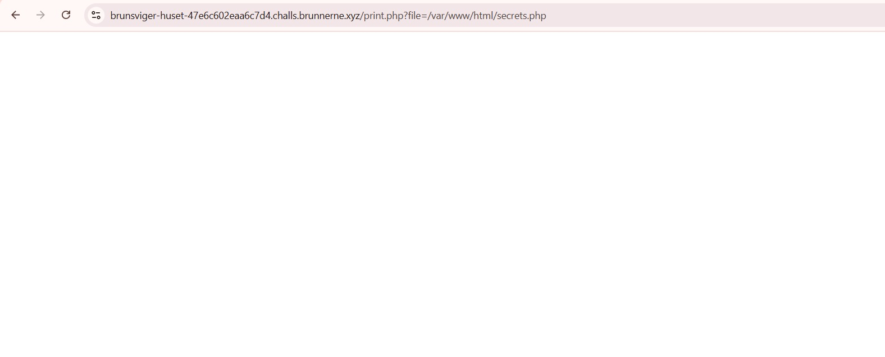
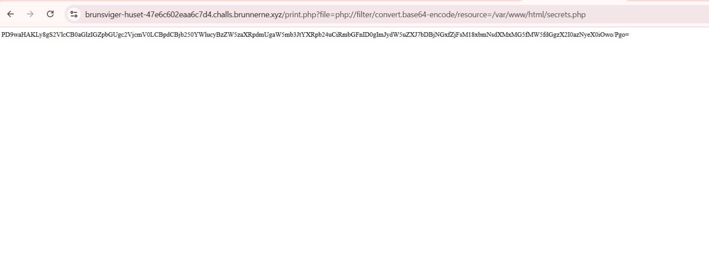
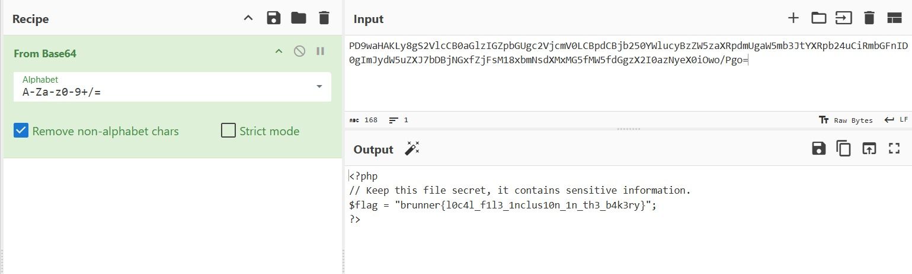

# Brunsviger Huset


## URL
https://brunnerctf.dk/challenges#Brunsviger%20Huset-33

## Requerimientos
El script requiere la librería requests.

La instalación de requerimientos se realiza con el siguiente comando:<br>
```pip install -r requirements.txt```

## Writeup
Al acceder al sitio web del reto, nos encontramos con una página principal bastante sencilla. El home muestra un estilo minimalista, relacionado con una panadería ficticia llamada Brunsviger Huset.
Al acceder al codigo fuente HTML de la pagina se encontro una funcion de impresion de calendario que contiene algunas rutas y un comentario expuesto que nos indicaba acceder a robots.txt. <br>
Como se puede ver en la siguiente imagen: <br>


<br>


Al acceder al archivo /robots.txt, que es frecuentemente utilizado por los administradores para indicar a los buscadores qué rutas no indexar y aunque no está pensado para exponer información sensible, este contenía referencias a un archivo llamado /secrets.php, lo que inmediatamente llamó la atención, ya que el nombre sugería que podría contener información sensible o relevante para el reto.


Al intentar acceder directamente a https://.../secrets.php, nos encontramos con una página en blanco. Esto indicaba que el archivo estaba presente pero probablemente contenía únicamente código PHP ejecutado en el servidor, sin mostrar su contenido en crudo. Por lo tanto, no podíamos ver el código directamente desde el navegador.

Revisando otras secciones del sitio, descubrimos que el endpoint print.php recibía un parámetro file. Un ejemplo de uso era:
https://.../print.php?file=/var/www/html/secrets.php
Esto sugería un Local File Inclusion (LFI), ya que podíamos indicar a print.php qué archivo cargar desde el servidor. Sin embargo, al intentar incluir directamente secrets.php, nuevamente obtuvimos solo una página en blanco.

Para poder ver el código fuente real de secrets.php, utilizamos wrappers de PHP. En particular, probamos con php://filter, que permite transformar la salida del archivo antes de enviarla al cliente.
https://.../print.php?file=php://filter/convert.base64-encode/resource=/var/www/html/secrets.php

Esta vez, en lugar de ver una página vacía, el servidor devolvió una cadena codificada en Base64.
El siguiente paso fue copiar esta cadena y decodificarla en CyberChef, obteniendo el contenido original de secrets.php:


La ejecucion del script se realiza con el siguiente comando:
```python3 script.py```

## Flag
brunner{l0c4l_f1l3_1nclus10n_1n_th3_b4k3ry}


