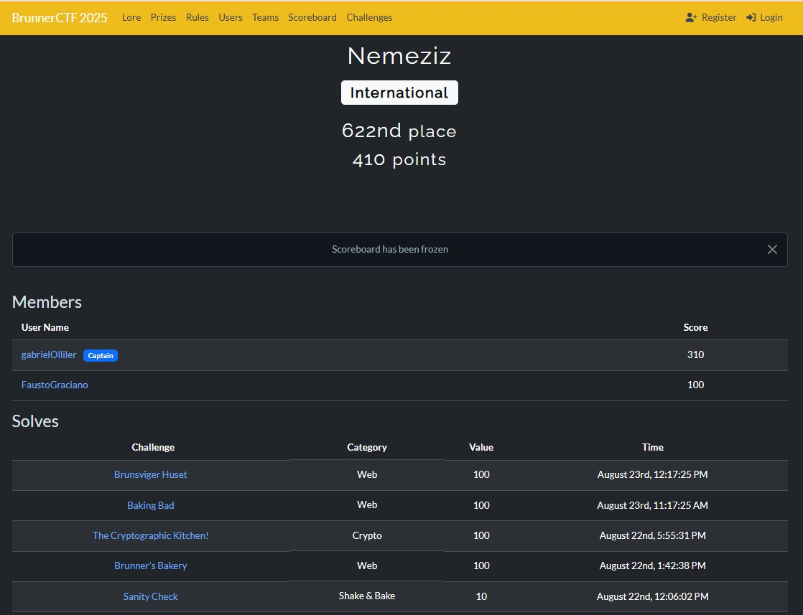

# Nemeziz
Los retos de esta carpeta fueron resueltos por el grupo Nemeziz correspondiente a Desarrollo Seguro De Aplicaciones - 2025

# Integrantes
    Ollier Gabriel 02958/4 
    Fausto Graciano 03028/2
    
# Retos
  Los retos se buscaron en el sitio https://ctftime.org/
  
 - https://ctftime.org/event/2792
ScriptCTF 2025 (vie, 15 ago. 2025, 21:00 ART — dom, 17 ago. 2025, 21:00 ART)

 - https://ctftime.org/event/2835			
Brunner CTF 2025 (vie, 22 ago. 2025, 09:00 ART — dom, 24 ago. 2025, 09:00 ART)

| Reto                   | Categoría      | Evento      |
|-------------------------|----------------|-------------|
| RSA-1                  | Cryptography   | ScriptCTF    |
| The Cryptographic Kitchen! | Cryptography   | BrunnerCTF |
| Baking Bad             | Web            | BrunnerCTF  |
| Brunner's Bakery       | Web            | BrunnerCTF  |
| Brunsviger Huset       | Web            | BrunnerCTF  |

 
 
