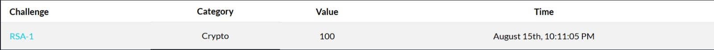
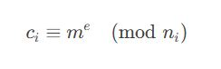
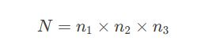
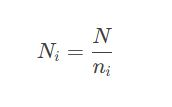
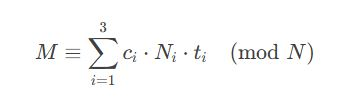
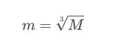

# RSA-1
 

# Descripción
 "Yú Tóngyī envió un mensaje a tres personas con un módulo único. Pero lo dejó vulnerable. ¡Descúbrelo!"
## Writeup
En este desafío se nos proporciona un archivo `salida.txt` con tres pares de valores \((n_i, c_i)\) y el exponente público \(e = 3\). Cada par corresponde a un cifrado RSA del mismo mensaje enviado a distintos destinatarios, pero con un módulo diferente.  

Los valores dados son:  

- \(n_1, c_1\)  
- \(n_2, c_2\)  
- \(n_3, c_3\)  
- \(e = 3\)  

Por la información proporcionada deducimos que se trata de RSA. La clave pública en cada caso está formada por \((n_i, e)\) y el mensaje cifrado es \(c_i\). La relación es:  

donde \(m\) es el mismo mensaje en los tres casos.  

### Vulnerabilidad  
El emisor comete el error de usar el mismo exponente pequeño (e = 3) y de enviar el mismo mensaje a varios destinatarios con módulos distintos. Esto habilita el ataque de difusión de Håstad (Håstad’s Broadcast Attack), se basa en que si el mismo mensaje \(m\) se cifra con el mismo exponente \(e\) sobre diferentes módulos coprimos \(n_1, n_2, n_3\), entonces podemos recombinar esos cifrados para recuperar el valor exacto de \(m^e\).  

Para unir las tres congruencias utilizamos el Teorema Chino del Resto (CRT). Los pasos son:  
1. Calculamos  

2. Para cada módulo \(n_i\), definimos  

3. Obtenemos el inverso modular de cada \(N_i\) respecto a \(n_i\):  

4. Construimos la combinación:  

El resultado \(M\) corresponde exactamente a \(m^3\).

### Recuperación del mensaje original
Una vez que tenemos \(M = m^3\), solo queda calcular la raíz cúbica entera exacta:  

Este cálculo se hace con un algoritmo de búsqueda binaria en Python. (ver en script.py) 

El valor obtenido, \(m\), es el mensaje original en formato numérico. Al convertirlo a bytes se obtiene el texto claro, que incluye el flag seguido de padding.  

## Flag
scriptCTF{y0u_f0und_mr_yu's_s3cr3t_m3g_12a4e4}
