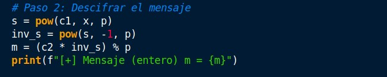
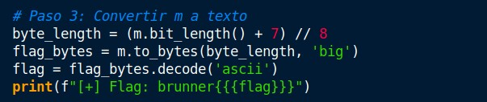

# The Cryptographic Kitchen!


## URL
https://brunnerctf.dk/challenges#The%20Cryptographic%20Kitchen!-78

## Requerimientos
El script requiere la librería sympy.

La instalación de requerimientos se realiza con el siguiente comando:<br>
```pip install -r requirements.txt```

## Writeup
El reto comienza indicándonos que el panadero ElGamal, preparó una tarta de queso y que olvidó mezclar un ingrediente secreto que debemos buscar. 
Con esta pista podemos darnos cuenta que se trata de descifrar un mensaje cifrado con el esquema de ElGamal. Se nos proporcionan los siguientes parámetros:

p = 14912432766367177751 (un número primo)
g = 2784687438861268863 (generador del grupo)
h = 8201777436716393968 (clave pública)
c1 = 12279519522290406516 (componente del cifrado)
c2 = 10734305369677133991 (componente del cifrado)

El cifrado ElGamal es un protocolo criptográfico de clave pública, que para descifrar, se necesita la clave privada x tal que h = g^x mod p. 
El desafío principal es calcular x resolviendo el logaritmo discreto x = log_g(h) mod p. Dado que p es un primo de 64 bits, es factible calcular x usando la función discrete_log de la biblioteca sympy.

Pasos de la solución
1. Calcular la clave privada x:
Resolvemos x = log_g(h) mod p usando sympy.ntheory.discrete_log.

 

2. Descifrar el mensaje:
Calculamos s = c1^x mod p.
Calculamos el inverso modular  s^(-1) mod p.
Obtenemos m = c2 ⋅ s^(-1) mod p.

 

3. Convertir m a texto:
Convertimos el entero m a bytes y luego decodificamos a ASCII.

 

La ejecución del script demora unos segundos.
Ejecutar con el siguiente comando:<br>
```python3 script.py```

## Flag
brunner{buTT3r}
