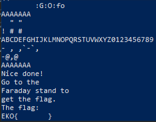

EkoParty 2024

En este desafío había un archivo llamado faraday.zip. Al descomprimirlo tenía un archivo llamado "llama_secret.gb". En este archivo utilicé el comando strings y obtuve lo siguiente:

La flag decía que había que irla a buscar a un stand (era en capital. Claramente no podía ir jaja).

Hice un script que descomprima el .zip y muestre el resultado del comando strings sobre su contenido.