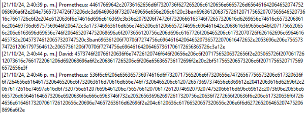
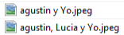
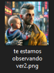
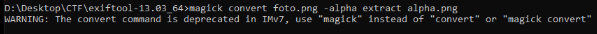
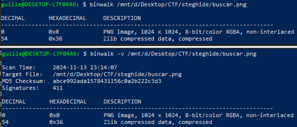
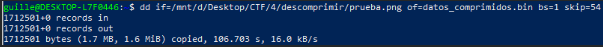
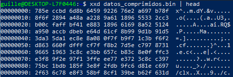

En este desafío había que investigar una desaparición de un hombre llamado David. Para descargar estaba disponible un archivo que tenía un estado de una PC. Lo pude abrir con un programa llamado autopsy. Dentro tenía un montón de archivos, lo primero que analicé fue una conversación en el siguiente archivo que estaba en la carpeta Escape.

Este archivo tenía una conversación entre David y Prometheus que parece estar en HEX. Al convertirlo a texto se obtiene la información de que la clave es el nombre de su hijo.

En otra carpeta llamada Familia había una imagen de David con su hijo, se llama "agustin y Yo.jpeg", entonces una clave puede ser: "agustin".

Investigando más los archivos, encuentro uno encriptado que se llama "te estamos observando ver2.7z", al intentar descomprimirlo con la clave obtenida, consigo la siguiente imagen.

Al analizar los metadatos de la imagen encontré algo del canal alpha, pense que podía ocultar información ahí pero no había nada, solo me generó una imagen en blanco

Usando binwalk pude ver que la imagen tenía algo a partir del HEX 36

Extraigo los bytes a partir del 54 y obtengo lo siguiente

Probé varias cosas, entre ellas poner esto en cyberchef, donde me detectó como que es un zlib, pero no logré extraerlo

