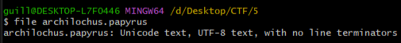
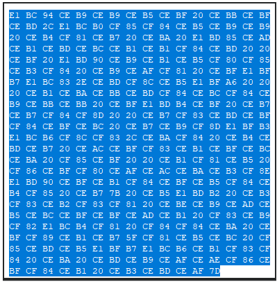
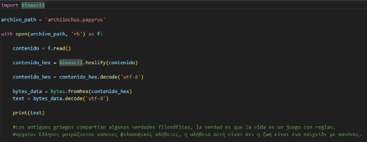

Descargué un archivo llamado archilochus.papyrus. Lo primero que hice fue analizarlo con el comando file y obtuve lo siguiente

El contenido del archivo en binario era el siguiente

Si pasaba esto a hexa obtenía el siguiente mensaje griego (adjunto el mensaje y la traducción) pero ahí no supe que más hacer.

