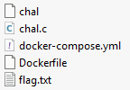
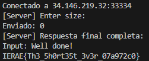

IERAE 2025

En este reto había para descargar una carpeta con archivos para mostrar como funcionaba el server. 

En el código de chal.c (adjunto) invitaban a causar fallo de segmentación (SEGV) para obtener la flag. Luego de levantar el container y hacer pruebas locales para obtener el resultado del archivo flag.txt, hice un script para conectar al servidor y enviarle un 0, lo cual como respuesta da la flag. Esto se debe a que al pedirle un buffer de tamaño 0, se causa un fallo de segmentación que dispara SIGSEGV, una señal del SO que hace que utiliza el script para mostrar la flag.

