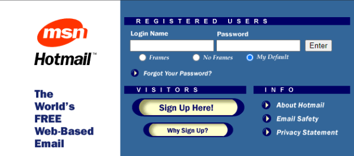
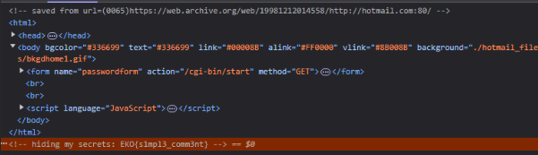
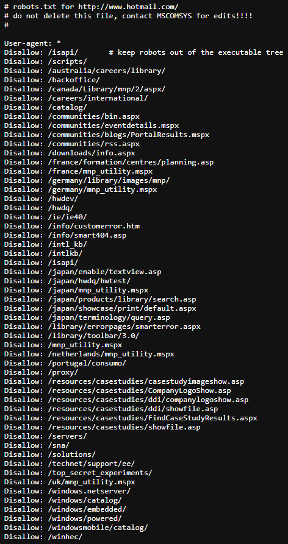
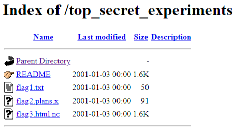
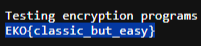

En este desafío había un link que llevaba a una página con diseño antiguo. 

La primer flag la encontré con un análisis simple de la página.

Luego, decidí probar si la página tenía el archivo para motores de búsqueda robots.txt. No solo existía, sino que además pude ver una carpeta sospechosa llamada top_secret_experiments.

Dentro tenía un archivo llamado flag1.txt. Dentro se encontraba la flag

