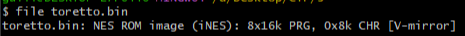
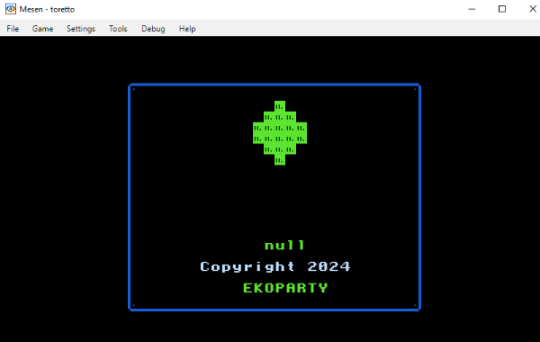
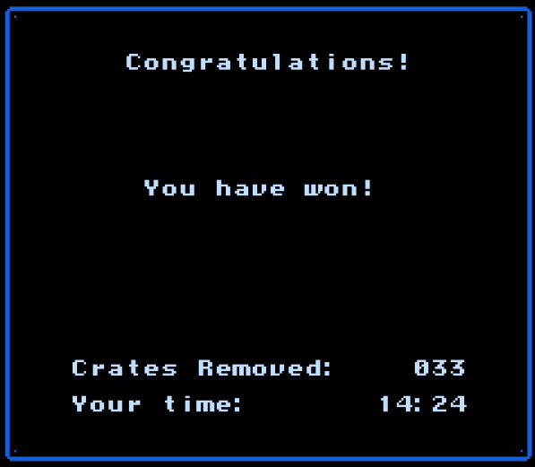
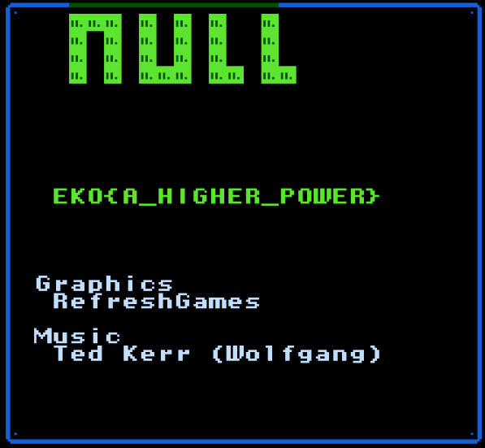

En este desafío había para descargar un archivo toretto.bin. Al utilizar el comando file pude obtener la siguiente información

Al darme cuenta que era un archivo NES lo intenté abrir con un emulador de NES (Mesen)

En el juego había que empujar unas cajas, era simple pero medio tosco. Después de estar casi 15 minutos lo pude pasar y al final me dieron una flag

