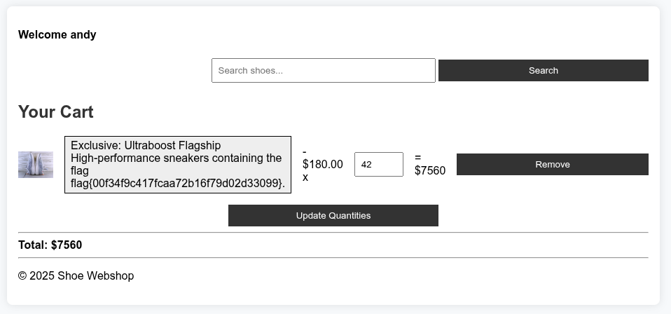

# WHY2025 CTF Writeup

**CTF Dates:**  
🗓️ **Fri, 08 Aug. 2025, 16:00 UTC** — **Mon, 11 Aug. 2025, 16:00 UTC**

**Official URL:**  
[https://ctf.why2025.org/](https://ctf.why2025.org/)  
**Challenge:** `shoe-shop-1.ctf.zone`

---

## 📝 Introducción del CTF:

We created a new shoe shop, so we can sell some shoes. Too bad the admin already put the exclusive shoe in his shopping cart, but feel free to browse around and check out if there are some shoes you like

## Resolucion:

Al ingresar a la página, observamos una tienda online de zapatillas. Como se menciona en la introducción, el administrador tiene su propio carrito de compras. Una vez registrados, notamos que los carritos de compra tienen el siguiente formato:

```
https://shoe-shop-1.ctf.zone/index.php?page=cart&id=<ID del carrito>
```

Probando con diferentes IDs, encontramos que el **ID=1** corresponde al carrito del administrador, donde se encuentra la flag:



[https://shoe-shop-1.ctf.zone/index.php?page=cart&id=1](https://shoe-shop-1.ctf.zone/index.php?page=cart&id=1)

> **Vulnerabilidad:**  
> Pérdida de control de acceso ([OWASP A01-2021](https://owasp.org/Top10/A01_2021-Broken_Access_Control/))

---

## 🛠️ Obtencion de la FLAG:

Ejecutar el script `script.py` con Python para obtener la flag. El mismo script utiliza un usuario previamente creado desde la pagina (andy - 1234).

---

## 🏁 FLAG

```
flag{00f34f9c417fcaa72b16f79d02d33099}
```