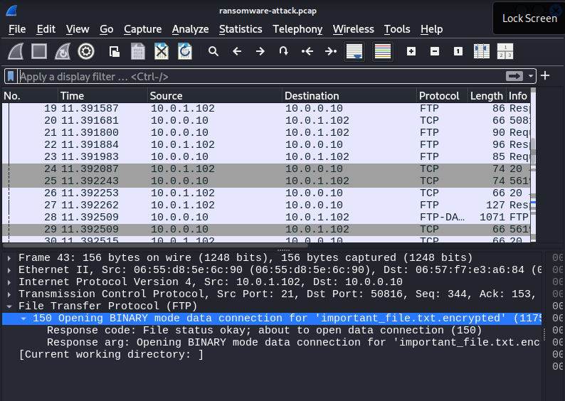
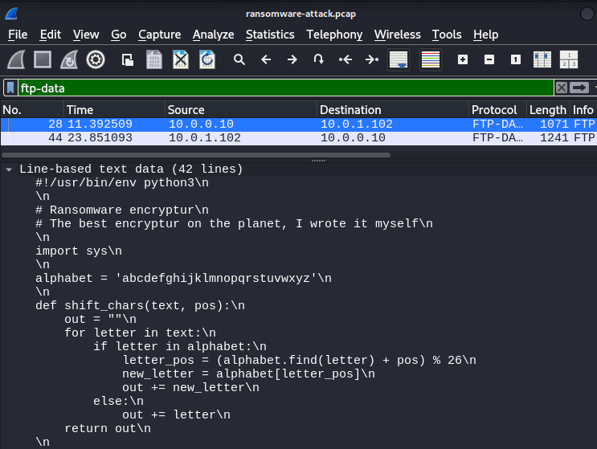
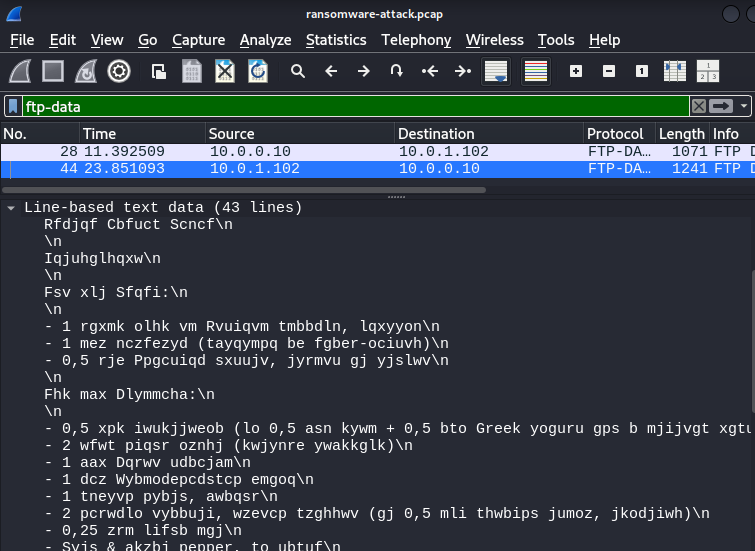

# WHY2025 CTF Writeup

**CTF Dates:**  
🗓️ **Fri, 08 Aug. 2025, 16:00 UTC** — **Mon, 11 Aug. 2025, 16:00 UTC**

**Official URL:**  
[https://ctf.why2025.org/](https://ctf.why2025.org/)  

**Challenge:** `Ransomware attack`

**Category:** Network

---

## 📝 Introducción del CTF:

> Our company was attacked with ransomware. All of our files were encrypted. Luckily we could get most of those files back from backups, but an important file is still encrypted. We found some information in our network logs. Can you help to get this file back?

## Resolucion:

Se proporciona un archivo comprimido `ransomwareattack.tgz`. Al descomprimirlo, obtenemos un archivo `ransomware-attack.pcap`, se trata de una captura de tráfico de red, el cuál se puede analizar en herramientas como **Wireshark**.

Al analizarlo, podemos ver tráfico FTP entre un atacante y el servidor `fileserver01`. 



Del tráfico FTP se extraen las siguientes credenciales:
- Servidor: fileserver01 FTP server (Version/6.4/OpenBSD/Linux-ftpd-0.17)
- Usuario: `administrator`
- Contraseña: `Welcome12`

Se identifican dos transferencias importantes:

1. STOR encryptur.py: El atacante sube el script de ransomware
2. RETR important_file.txt.encrypted: El atacante descarga un archivo encriptado

Importante: Ambos archivos se pueden obtener de los paquetes `ftp-data`.





### Script `encryptur.py`

El algoritmo de encriptación funciona asi:

1. Procesa el texto en chunks de 10 caracteres.
2. A cada uno le aplica un cifrado César con shift incremental.
3. Dicho shift empieza en 1, se va incrementando hasta llegar a 26 y se resetea.

### `important_file.txt.encrypted`

Dicho archivo posee texto encriptado.

```
Fhk max Dlymmcha:

- 0,5 xpk iwukjjweob (lo 0,5 asn kywm + 0,5 bto Greek yoguru gps b mjijvgt xgtulrq)
- 2 wfwt piqsr oznhj (kwjynre ywakkglk)
- 1 aax Dqrwv udbcjam
- 1 dcz Wybmodepcdstcp emgoq
- 1 tneyvp pybjs, awbqsr
- 2 pcrwdlo vybbuji, wzevcp tzghhwv (gj 0,5 mli thwbips jumoz, jkodjiwh)
- 0,25 zrm lifsb mgj
- Syjs & akzbj pepper, to ubtuf
- b ftkbbng qi iodj{dg1g53fj1i00e9239i29jifgjijg2964}
```

- Observando el archivo, podemos ver que la flag se encuentra ahí...

---

## 🛠️ Obtencion de la FLAG:

El script para obtener la flag procesa el texto en el mismo orden (chunks de 10) pero aplicando el shift en dirección opuesta al `encryptur.py`

```bash
python3 script.py
```

Al ejecutar el script se obtiene el texto original que resulta ser una receta de cocina. Dentro de la misma se encuentra la flag

---

## 🏁 FLAG

```
flag{ad1c53bf1e00a9239d29edaadcda2964}
```